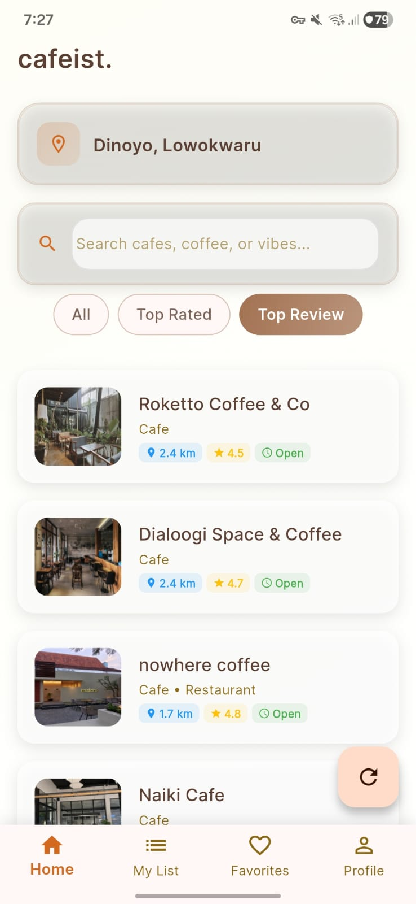
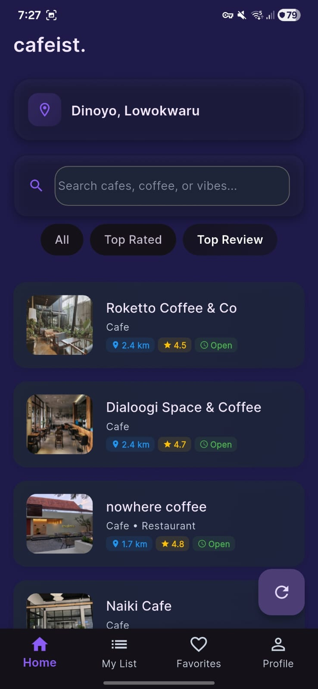
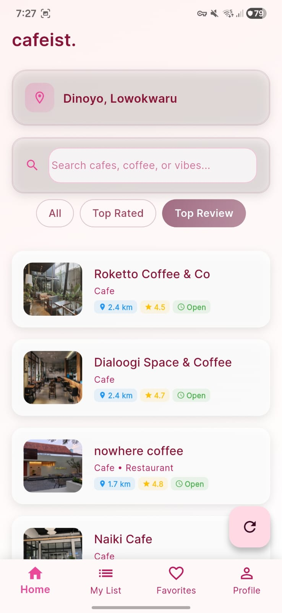
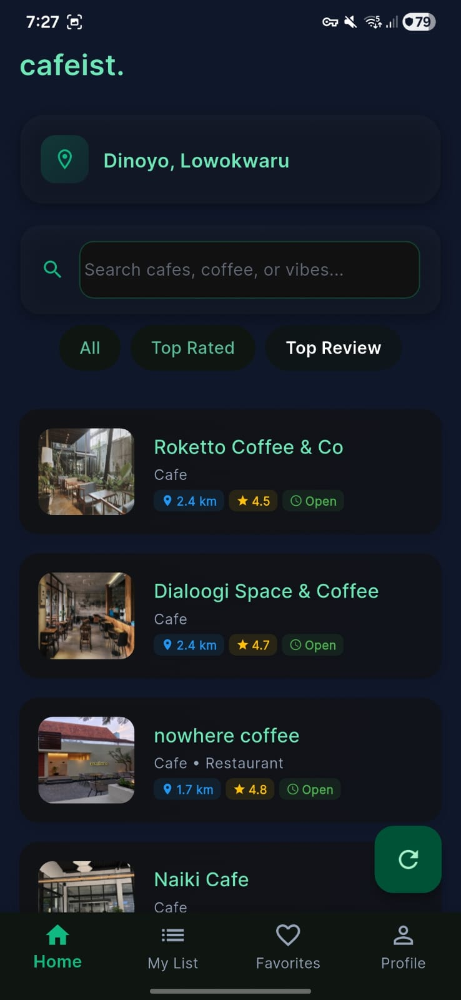
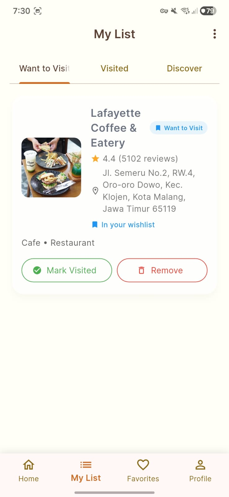
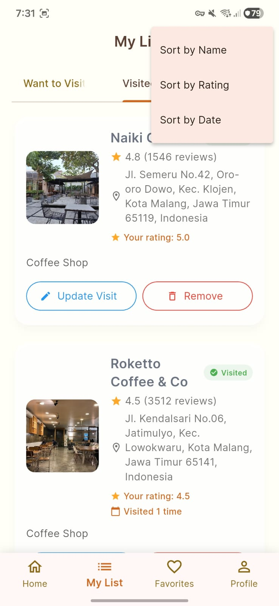
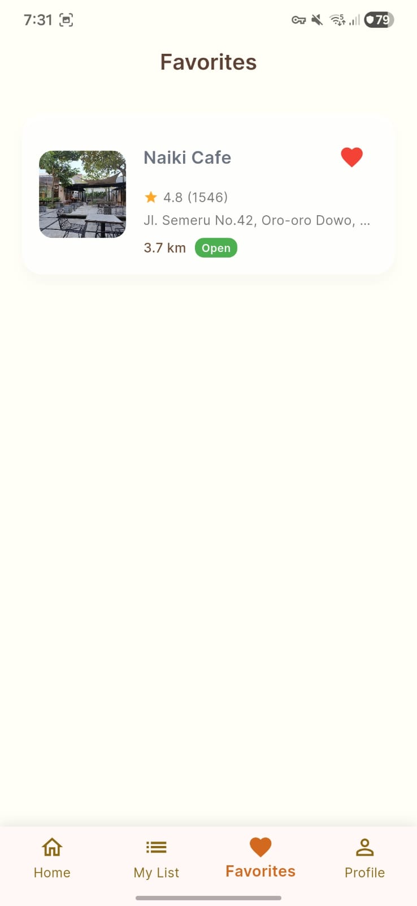
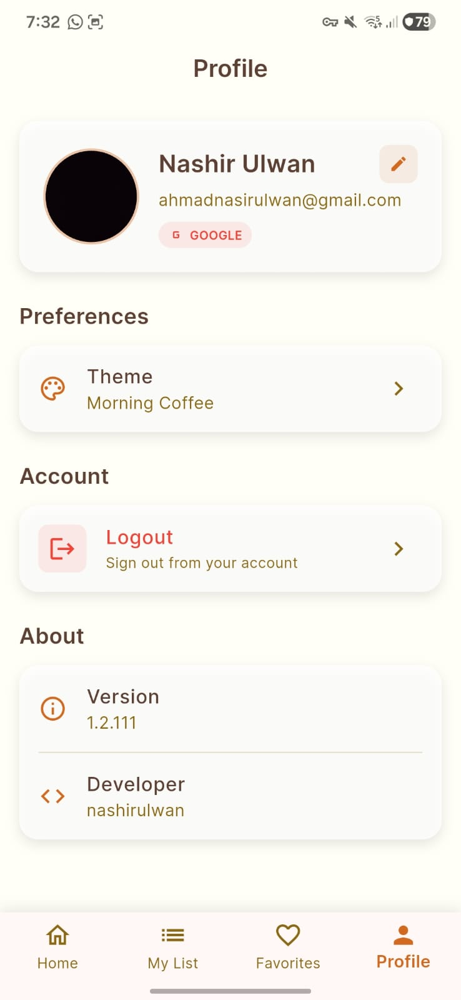
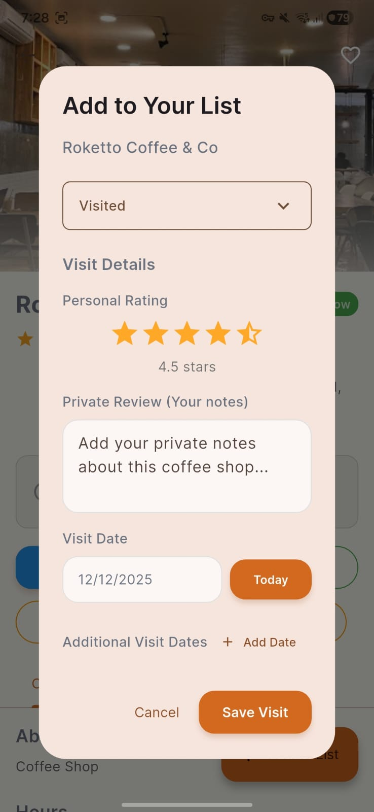
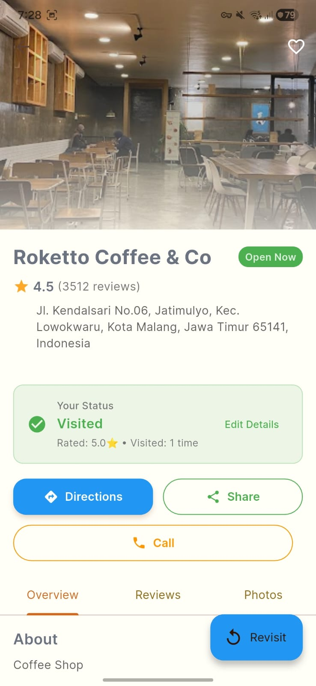

# Cafeist - Coffee Shop Finder & Tracker

Cafeist is a mobile application developed for the Mobile Programming Final Semester Exam (UAS). It allows users to find coffee shops using the Google Places API and track their visits.

## Project Description

This project demonstrates the integration of a public RESTful API into a Flutter application. Unlike the previous version which used static data, this application fetches real-time data from the Google Places API. It implements clean architecture principles, separating the UI, business logic (Providers), and data layer (Services).

## Technical Specifications

### Data Source (API)
- **API**: Google Places API (via HTTP)
- **Endpoints Used**:
  - Text Search (for searching cafes)
  - Nearby Search (for finding cafes around user location)
  - Place Details (for fetching reviews, photos, and operating hours)
- **Implementation**: Data is fetched using the `http` package and parsed into `CoffeeShop` model objects.

### State Management & Architecture
- **Pattern**: Provider Pattern
- **State Management**: `Provider` package is used to handle application state, including loading, success, and error states.
- **Async Handling**: UI effectively handles asynchronous data fetching with proper loading indicators and error messages.
- **Separation of Concerns**:
  - `lib/services/`: Handles API calls and data parsing.
  - `lib/providers/`: Manages state and business logic.
  - `lib/screens/`: Handles UI presentation.
  - `lib/models/`: Defines data structures.

### Key Features
1.  **Real-time Data Fetching**: Information about coffee shops (name, rating, address, open status) is fetched live from the internet.
2.  **Search & Filter**: Users can search for cafes by name or filter by rating and proximity.
3.  **Local Persistence**: User preferences (favorites, visit history) are stored locally and synced when authenticated.
4.  **UI/UX**: Modern implementation with responsive design and visual feedback for network operations.

## App Overview

### 4 Different Themes
<p align="center">
  
  
  
  
</p>

### Feature Overview
<p align="center">
  
  
  
  
</p>

### Use Flow (Tracking)
<p align="center">
  
  
</p>

## Setup Instructions

1.  **Clone the repository**
    ```bash
    git clone https://github.com/nashirulwan/cafeist.git
    cd cafeist
    ```

2.  **Environment Configuration**
    Create a `.env` file in the root directory and add your Google Maps/Places API key:
    ```
    GOOGLE_PLACES_API_KEY=your_api_key_here
    ```

3.  **Install Dependencies**
    ```bash
    flutter pub get
    ```

4.  **Run Application**
    ```bash
    flutter run
    ```

## Requirements Fulfillment (UAS)

-   **HTTP Request (GET)**: Implemented in `PlacesService`.
-   **JSON Serialization**: Implemented in `CoffeeShop` model.
-   **Asynchronous UI**: Implemented in `CoffeeShopProvider` and Consumer widgets.
-   **State Management**: Uses `Provider` package.
-   **Search/Filter**: Implemented in `Home` screen.
